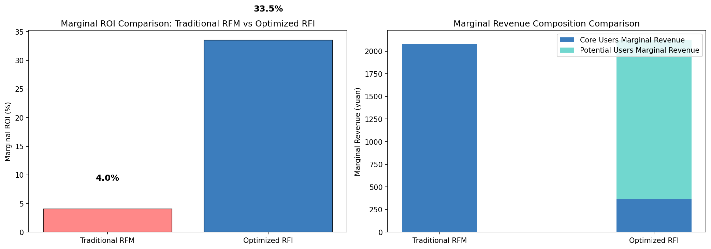
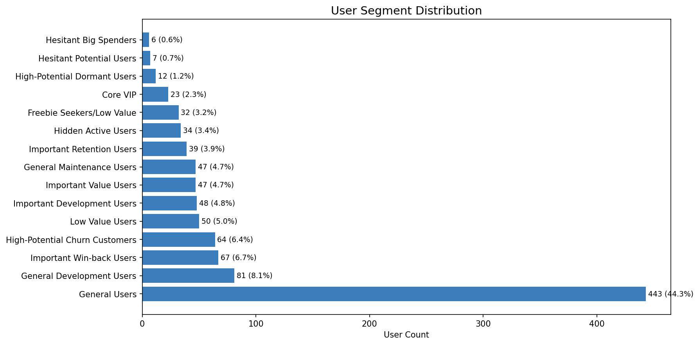

# Results: RFM-I Customer Segmentation

**Bottom line:** a modified RFM model that adds purchase intent and income
context lifted simulated coupon ROI from **4.0% to 33.5% (≈8x)**, while
spending **20% less** than the traditional targeting approach.

## Coupon ROI: traditional RFM vs. RFM-I

Traditional RFM spends the full budget on 200 "top-tier" customers who mostly
would have bought anyway, for a 4.0% marginal ROI. RFM-I reallocates the same
budget toward a smaller, better-targeted group — 70 core customers plus 89
newly-identified high-potential customers — spending 20% less while lifting
marginal ROI to 33.5%.

## New customer segments RFM-I uncovered

Traditional RFM only sees recency, frequency, and spend, so it treats these
customers as low priority. RFM-I catches them because it also weighs purchase
intent and income:

- **Hesitant Big Spenders** — high income and high browsing intent, but low
  purchase frequency. RFM would score them as low-value; they're actually
  primed to convert.
- **High-Potential Churn Customers** — high income and high historical spend,
  but recently inactive. RFM would treat them as gone; they're a targeted
  win-back opportunity.
- **High-Potential Dormant Users** and 4 other segments the model identifies
  by combining intent, income, and engagement signals RFM ignores.

## How it works, in brief

1. Standard RFM (Recency, Frequency, Monetary) is extended with engineered
   **Intent** (time on site, pages viewed) and **Income-adjusted** signals.
2. These combine into a single composite score (RFM-I) that re-ranks
   customers by real commercial potential, not just past spend.
3. The model's segments are validated with a simulated A/B test comparing
   coupon allocation under both strategies.

For the full methodology, feature engineering, and code: see
[`RFM_Customer_Segmentation.ipynb`](RFM_Customer_Segmentation.ipynb) or the
[README](README.md).
